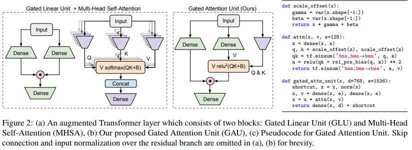

</img>

## FLASH - Pytorch (wip)

Implementation of the Transformer variant proposed in the paper <a href="https://arxiv.org/abs/2202.10447">Transformer Quality in Linear Time</a>

## Install

```bash
$ pip install FLASH-pytorch
```

## Usage

The main novel circuit in this paper is the "Gated Attention Unit", which they claim can replace multi-headed attention while reducing it to just one head.

It uses a relu squared activation in place of the softmax, the activation of which was first seen in the <a href="https://arxiv.org/abs/2109.08668">Primer paper</a>, and the use of ReLU in <a href="https://arxiv.org/abs/2104.07012">ReLA Transformer</a>. The gating style seems mostly inspired by <a href="https://arxiv.org/abs/2105.08050">gMLPs</a>.

```python
import torch
from flash_pytorch import GAU

gau = GAU(
    dim = 512,
    query_key_dim = 128,     # query / key dimension
    causal = True,           # autoregressive or not
    expansion_factor = 2,    # hidden dimension = dim * expansion_factor
)

x = torch.randn(1, 1024, 512)
out = gau(x) # (1, 1024, 512)
```

## Citations

```bibtex
@article{Hua2022TransformerQI,
  title   = {Transformer Quality in Linear Time},
  author  = {Weizhe Hua and Zihang Dai and Hanxiao Liu and Quoc V. Le},
  journal = {ArXiv},
  year    = {2022},
  volume  = {abs/2202.10447}
}
```
